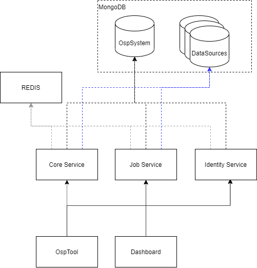

# Architectural overview

OSP consists of:
1) Database
1) REDIS
1) Services
    * Core Service: The central service to manage structured data.
    * Job Service: Executes jobs for platform management as well for custom actions
    * Identity Service: Manages Authentication/Authorization as SSO provider 
1) Clients
    * OspTool: A CLI tool to manage the platform
    * Dashboard: A administration UI
    

